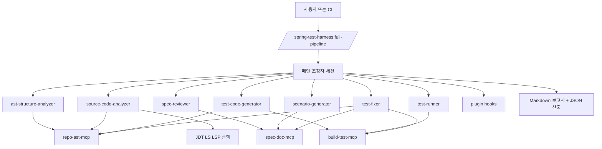
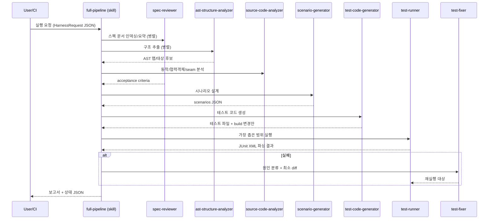

# Spring 테스트 하네스 플러그인 설계 보고서

> 대상: Claude Code CLI(Opus) 기반 "Spring 테스트코드 생성 하네스 플러그인"
> 작성 기준일: 2026-06-24 · 검증 출처: 공식 문서/저장소 우선
> 본 보고서의 모든 스캐폴드는 같은 디렉터리(`spring-test-harness-plugin/`)에 실제 파일로 생성되어 있다.

---

## 실행 요약

- **전체 접근 전략**: 팀 배포·버전관리가 목표이므로 standalone `.claude/`가 아니라 **Claude Code 공식 plugin 패키지**로 묶는다. 메인 세션은 조정자(skill), 세부 분석은 subagent, 데이터 접근은 공유 MCP 3종, 반복 절차는 skill로 분리한다. 실행 순서는 **읽기 중심 분석 → 시나리오 → 생성 → 좁은 범위 실행 → 최소 보정**의 보수적 파이프라인이다.
- **핵심 제약(검증 완료)**:
  1. **plugin-shipped subagent는 `hooks`/`mcpServers`/`permissionMode` frontmatter를 선언할 수 없다.** 따라서 "에이전트별 MCP 분리"는 frontmatter 직결이 아니라 **공유 MCP + skill 라우팅 + tools/disallowedTools 경계**로 구현하고, 강한 격리가 필요한 에이전트만 `.claude/agents/`로 승격하는 하이브리드를 쓴다. (출처: [Subagents](https://code.claude.com/docs/en/sub-agents))
  2. **Spring Boot 4.1.0**이 현재 stable이며 BOM이 **JUnit Jupiter 6.0.x / Mockito 5.2x**를 관리한다 → 사용자가 "JUnit5"를 *정확한 5.x 고정*으로 요구하면 최신 BOM 기본값과 **충돌**한다. 이 충돌은 별도 표로 명시한다.
  3. hooks/monitors는 **사용자 권한으로, 비샌드박스**로 실행된다 → 네트워크 기본 차단, 경로 allowlist, 인자 escaping, redaction을 기본값으로 둔다.
- **권장안 한 줄 결론**: **공식 plugin 구조 + 7개 read/write 분리 에이전트(skill 오케스트레이션) + 공용 MCP 3종(repo-ast / spec-doc / build-test) + 선택적 JDT LS LSP** 조합을, 본 보고서의 스캐폴드 그대로 Day-1 도입한다.

---

## 우선 참고할 공식 출처

| 주제 | 공식 출처 | 채택 이유 | 비고 |
|---|---|---|---|
| Claude Code 개요 | [Overview](https://code.claude.com/docs/en/overview) | CLI/IDE/브라우저 범위 확인 | 공식 |
| 플러그인 | [Plugins reference](https://code.claude.com/docs/en/plugins) | manifest·컴포넌트·설치범위 | 공식 |
| Skills | [Agent Skills](https://code.claude.com/docs/en/skills) | lazy load·namespace·자동호출 | 공식 |
| Subagents | [Subagents](https://code.claude.com/docs/en/sub-agents) | frontmatter·tool 제어·**plugin 제약** | 공식 (아키텍처 결정적) |
| Hooks | [Hooks reference](https://code.claude.com/docs/en/hooks) | 이벤트·JSON I/O·보안 | 공식 |
| MCP (Claude Code) | [MCP](https://code.claude.com/docs/en/mcp) | 연결·설정·scope | 공식 |
| MCP 표준 | [MCP spec](https://modelcontextprotocol.io/specification) | tools/resources/prompts/lifecycle | 공식 표준 |
| Spring 요구사항 | [System Requirements](https://docs.spring.io/spring-boot/system-requirements.html) | Boot/Framework/Java/Gradle/Maven 기준 | 공식 |
| Spring 테스트 | [Testing](https://docs.spring.io/spring-framework/reference/testing.html), [Test slices](https://docs.spring.io/spring-boot/reference/testing/spring-boot-applications.html) | slice·MockMvc·@MockitoBean | 공식 |
| BOM 버전 | [Dependency Versions](https://docs.spring.io/spring-boot/appendix/dependency-versions/index.html) | JUnit/Mockito 관리값 | 공식 |
| JUnit | [JUnit User Guide](https://docs.junit.org/current/user-guide/) | 구조·parameterized·병렬(opt-in) | 공식 |
| Gradle | [Java Testing](https://docs.gradle.org/current/userguide/java_testing.html) | useJUnitPlatform·maxParallelForks·XML | 공식 |
| Maven | [Surefire](https://maven.apache.org/surefire/maven-surefire-plugin/), [Compiler](https://maven.apache.org/plugins/maven-compiler-plugin/) | JUnit Platform·`--release`·rerun | 공식 |
| 코드 스타일 | [Google Java Style](https://google.github.io/styleguide/javaguide.html) | 생성 코드 포맷 기준 | 공식 |
| CI | [GH Actions: Java w/ Maven](https://docs.github.com/actions/automating-builds-and-tests/building-and-testing-java-with-maven) · [Gradle](https://docs.github.com/actions/automating-builds-and-tests/building-and-testing-java-with-gradle) · [setup-java](https://github.com/actions/setup-java) · [upload-sarif](https://docs.github.com/code-security/code-scanning/integrating-with-code-scanning/uploading-a-sarif-file-to-github) | CI·캐시·아티팩트·SARIF | 공식 |
| Java AST | [JavaParser](https://javaparser.org/) · [Eclipse JDT LS](https://github.com/eclipse-jdtls/eclipse.jdt.ls) | AST + semantic navigation 분리 | 공식 사이트/레포 |

---

## 설계 전제와 해석

### 사용자 요구의 규격 재정의
- 산출물의 본질은 "플러그인 소스 일부"가 아니라 **재배포 가능한 plugin 패키지 + 설계 근거**다.
- 에이전트 7종은 그대로 유지하되, **plugin 제약을 구조로 흡수**한다.

### 입력값 정리(현재 저장소 기준)
현재 작업 디렉터리 `/Users/johyeonsig/test_autoevermation`에는 `.omc/` 외 Java/빌드 파일이 없다 → **실제 Spring 프로젝트 없음**. 따라서 프로젝트 관련 입력은 전부 "미지정"이며, 본 하네스는 그런 "미지정" 상황에서 **auto-detect 우선**으로 동작하도록 설계한다.

| 입력 항목 | 값 | 비고 |
|---|---|---|
| 프로젝트 루트 | 현재 저장소(빈 디렉터리) | Spring 프로젝트 미존재 |
| 스펙 문서 경로 | 미지정 | `ingest-specs`가 allowlist로 수용 |
| 빌드 도구 | 미지정 → `auto` | `detect-build-tool.sh`로 감지 |
| 대상 모듈/패키지/클래스 | 미지정 → auto-detect | AST 분석으로 후보 추출 |
| 테스트 범위 | 미지정 → `mixed` | unit 우선, slice 다음, integration 최소 |
| Java 버전 | 미지정 → auto-detect | 17–26 호환 |
| Spring 버전 | 미지정 → latest stable 조사 | 4.1.0 기준 |
| JUnit 정책 | 미지정 | 아래 충돌 표 참조 |
| 코드 스타일 | Google Java Style 고정 | — |
| CI 대상 | GitHub Actions 고정 | — |

### 최신 Spring과 "JUnit5" 요구 충돌 분석 (필수)

| 항목 | Boot 4.1.0 BOM 기본값 | "JUnit5 정확 고정" 요구 시 | 권장 |
|---|---|---|---|
| JUnit Platform/Jupiter | **6.0.x** (Jupiter 6 라인) | 5.10~5.11.x로 강제 다운핀 필요 | `jupiter-style`(API는 JUnit5 관용구, 버전은 BOM 위임)이 기본. 진짜 5.x 고정은 **정책 예외**로 별도 핀 + 회귀 위험 명시 |
| Mockito | **5.2x** | `mockito.version` 오버라이드 | BOM 위임 권장 |
| Java | 17–26 | 동일 | — |
| 해석 | "JUnit5"는 보통 **Jupiter API 스타일**을 의미 | 숫자 5.x 고정은 별개 의사결정 | 보고서/스캐폴드는 `jupiter-style` 기본, `strict-5x`는 옵트인 |

> **결론**: `junitPolicy: jupiter-style`(=BOM-managed)을 기본으로 채택. `strict-5x`는 사용자가 명시할 때만 적용하고, build 파일에 명시적 version pin + CHANGELOG 경고를 남긴다.

---

## 권장 아키텍처

### plugin vs standalone
- **standalone `.claude/`**: 개인/실험에 빠름. 팀 공유·버전관리·마켓플레이스 배포에는 부적합.
- **plugin**: self-contained 디렉터리로 skills/agents/hooks/MCP를 묶어 배포·재사용. **채택.**

### 역할 분리
- **Skill** = 절차서·오케스트레이션(필요 시 lazy load). `full-pipeline`이 7개 단계 skill을 조정.
- **Subagent** = 분리된 컨텍스트에서 분석/생성/실행/보정. 대형 저장소 컨텍스트 오염 방지.
- **MCP** = 데이터/도구 접근(읽기 중심 AST·문서, 실행 중심 build-test). 플러그인 루트의 **공유 자원**.
- **Hooks** = 최소한의 가드(redaction, 위험 명령 차단 알림). 사용자 권한 실행이므로 보수적.
- **LSP(JDT LS, 선택)** = 정의 이동·참조·진단 등 semantic navigation. AST(JavaParser)와 **역할 분리**.

### 아키텍처 다이어그램



### 워크플로우 다이어그램



### 권장 파일·디렉터리 구조

```
spring-test-harness-plugin/
├── .claude-plugin/
│   └── plugin.json            # manifest (반드시 .claude-plugin/ 안)
├── skills/                    # 이하 전부 plugin root 직하
│   ├── full-pipeline/SKILL.md
│   ├── ingest-specs/SKILL.md
│   ├── analyze-ast/SKILL.md
│   ├── analyze-source/SKILL.md
│   ├── generate-scenarios/SKILL.md
│   ├── generate-tests/SKILL.md
│   ├── run-tests/SKILL.md
│   └── repair-tests/SKILL.md
├── agents/
│   ├── ast-structure-analyzer.md
│   ├── source-code-analyzer.md
│   ├── spec-reviewer.md
│   ├── scenario-generator.md
│   ├── test-code-generator.md
│   ├── test-runner.md
│   └── test-fixer.md
├── hooks/hooks.json
├── scripts/
│   ├── detect-build-tool.sh
│   ├── run-tests.sh
│   ├── collect-test-reports.py
│   ├── redact-secrets.py
│   └── postprocess-report.py
├── examples/                  # 예제 코드·CI·build·JSON
├── .mcp.json
├── .lsp.json
├── settings.json
├── README.md
└── CHANGELOG.md
```

### 권장 권한 모델

| 에이전트 | 성격 | tools | disallowedTools |
|---|---|---|---|
| ast-structure-analyzer | read-only | Read, Grep, Glob, mcp(repo-ast) | Write, Edit, Bash |
| source-code-analyzer | read-only | Read, Grep, Glob, mcp(repo-ast, lsp) | Write, Edit, Bash |
| spec-reviewer | read-only | Read, Grep, Glob, mcp(spec-doc) | Write, Edit, Bash |
| scenario-generator | read-only | Read, mcp(spec-doc, repo-ast) | Write, Edit, Bash |
| test-code-generator | write | Read, Write, Edit, mcp(repo-ast, build-test) | (Bash 제한) |
| test-runner | execute | Read, Bash, mcp(build-test) | Write, Edit |
| test-fixer | write+execute | Read, Write, Edit, Bash, mcp(all) | — (isolation: worktree 권장) |

---

## 에이전트별 상세 설계

> 공통 출력 스키마(모든 에이전트): `status`(`ok`/`partial`/`failed`), `summary`, `evidence[]`, `warnings[]`, `errors[]`, `nextActions[]`. 에이전트 특화 필드는 아래에 추가. CI에서는 `claude -p --output-format json`(+ 가능 시 스키마 검증) 사용.

### ast-structure-analyzer
#### 목적
JavaParser 기반으로 클래스/메서드/필드/애노테이션/의존 그래프를 **구조만** 정밀 추출. 추측 금지, unresolved symbol은 별도 배열.
#### 호출 조건
파이프라인 2단계(구조 분석). 대상 모듈/패키지/클래스 식별 직전.
#### MCP 설계
`repo-ast-mcp` (읽기 전용). 코드 본문 유출 금지, AST 노드 맵만 반환.
#### Skill 설계
`/spring-test-harness:analyze-ast` 가 본 에이전트를 호출.
#### 입력 포맷
`{ projectRoot, targets[], targetModules[] }`
#### 출력 포맷
공통 + `testTargets[]`, `astNodeMap`, `dependencyGraph`, `unresolvedSymbols[]`, `riskPoints[]`
#### JSON 스키마
```json
{
  "$schema":"https://json-schema.org/draft/2020-12/schema",
  "title":"AstAnalysisResult","type":"object",
  "required":["status","summary","testTargets","unresolvedSymbols"],
  "properties":{
    "status":{"enum":["ok","partial","failed"]},
    "summary":{"type":"string"},
    "testTargets":{"type":"array","items":{"type":"object","properties":{
      "fqcn":{"type":"string"},"kind":{"enum":["controller","service","repository","component","pojo","unknown"]},
      "publicMethods":{"type":"array","items":{"type":"string"}}},"required":["fqcn","kind"]}},
    "dependencyGraph":{"type":"object"},
    "unresolvedSymbols":{"type":"array","items":{"type":"string"}},
    "riskPoints":{"type":"array","items":{"type":"string"}},
    "evidence":{"type":"array","items":{"type":"string"}},
    "warnings":{"type":"array"},"errors":{"type":"array"},"nextActions":{"type":"array"}
  }
}
```
#### 예시 프롬프트
"`repo-ast-mcp.extract_test_targets`로 대상 패키지의 public 메서드와 Spring stereotype을 추출하라. symbol을 추론하지 말고 unresolvedSymbols로 분리하라. 코드 본문은 반환하지 마라."
#### 실패 처리
`SYMBOL_UNRESOLVED`, `UNSUPPORTED_PROJECT_SHAPE` → partial 반환 + nextActions에 LSP 보강 권고.
#### 성능 고려사항
대상 스코프로만 파싱. 전체 트리 파싱 금지. 결과 캐시 키 = 파일 해시.
#### 보안 고려사항
read-only, vendor/build output read deny, 코드 유출 금지.

### source-code-analyzer
#### 목적
구조가 아닌 **동작** 관점: 호출 관계, 예외 흐름, DI 패턴, 트랜잭션 경계, 외부 I/O/DB/clock/randomness(테스트 seam) 식별.
#### 호출 조건
AST 분석 직후.
#### MCP 설계
`repo-ast-mcp` + 선택 `JDT LS`(정의 이동/참조).
#### Skill 설계
`/spring-test-harness:analyze-source`.
#### 입력/출력
입력 `{ codeRoots[], targetSymbols[], buildMetadata }` / 출력 공통 + `collaborators[]`, `sideEffects[]`, `testSeams[]`, `transactionBoundaries[]`.
#### JSON 스키마
```json
{ "title":"SourceAnalysisResult","type":"object",
  "required":["status","summary","collaborators","testSeams"],
  "properties":{"status":{"enum":["ok","partial","failed"]},
    "collaborators":{"type":"array","items":{"type":"object"}},
    "sideEffects":{"type":"array","items":{"type":"string"}},
    "testSeams":{"type":"array","items":{"type":"string"}}}}
```
#### 예시 프롬프트
"각 대상의 외부 의존(DB/HTTP/clock/random)을 식별해 mocking seam을 제안하라. 동작 흐름과 예외 경로를 분리해 기술하라."
#### 실패/성능/보안
LSP 미가용 시 AST-only로 degrade(partial). read-only. 대상 심볼 그래프만 탐색.

### spec-reviewer
#### 목적
스펙 문서 경로를 받아 **누락 없이** 요약하고 acceptance criteria/규칙/edge case/금지사항을 정규화.
#### 호출 조건
파이프라인 1단계(문서 인덱싱), AST와 병렬.
#### MCP 설계
`spec-doc-mcp`. 경로 allowlist, 민감정보 redaction.
#### Skill 설계
`/spring-test-harness:ingest-specs`.
#### 입력/출력
입력 `{ specDocPaths[], priority[], domainKeywords[] }` / 출력 공통 + `requirements[]`, `acceptanceCriteria[]`, `prohibitions[]`, `glossary{}`.
#### JSON 스키마
```json
{ "title":"SpecReviewResult","type":"object",
  "required":["status","acceptanceCriteria"],
  "properties":{"acceptanceCriteria":{"type":"array","items":{"type":"object",
    "properties":{"id":{"type":"string"},"given":{"type":"string"},
      "when":{"type":"string"},"then":{"type":"string"},
      "sourceDoc":{"type":"string"}},"required":["id","then"]}}}}
```
#### 예시 프롬프트
"문서를 청크로 인덱싱하고 테스트 가능한 acceptance criteria를 Given/When/Then으로 정규화하라. 읽을 수 없는 문서는 SPEC_DOC_UNREADABLE로 보고하라."
#### 실패/성능/보안
`SPEC_DOC_UNREADABLE` partial. 긴 문서는 별도 subagent 컨텍스트로 처리(메인 오염 방지). redaction 필수.

### scenario-generator
#### 목적
unit/slice/integration 시나리오 설계. 중복 병합, 빠른 테스트 우선, 느린 시나리오는 사유 명시.
#### 호출 조건
AST+source+spec 결과 수렴 후.
#### MCP 설계
`spec-doc-mcp` + `repo-ast-mcp`.
#### Skill 설계
`/spring-test-harness:generate-scenarios`.
#### 입력/출력
입력 = 위 세 결과 / 출력 공통 + `scenarios[]`(우선순위·타입·매핑된 criteria id).
#### JSON 스키마
```json
{ "title":"ScenarioSet","type":"object","required":["status","scenarios"],
  "properties":{"scenarios":{"type":"array","items":{"type":"object",
    "required":["id","title","type","target","priority"],
    "properties":{"id":{"type":"string"},"title":{"type":"string"},
      "type":{"enum":["unit","slice","integration"]},
      "target":{"type":"string"},"priority":{"enum":["P0","P1","P2"]},
      "criteriaRefs":{"type":"array","items":{"type":"string"}},
      "slowReason":{"type":"string"}}}}}}
```
#### 예시 프롬프트
"acceptance criteria와 testSeams를 매핑해 최소 시나리오 집합을 만들라. unit→slice→integration 순으로 우선순위를 부여하고 중복은 병합하라."
#### 실패/성능/보안 read-only.

### test-code-generator
#### 목적
JUnit5(Jupiter)/Spring Test/Mockito 기반 **컴파일 가능한** 테스트 작성. import/fixture 완결.
#### 호출 조건
시나리오 확정 후.
#### MCP 설계
`repo-ast-mcp`(시그니처 확인) + `build-test-mcp`(의존성/스타일).
#### Skill 설계
`/spring-test-harness:generate-tests`.
#### 입력/출력
입력 `{ scenarios[], buildTool, junitPolicy, stylePolicy }` / 출력 공통 + `files[]`(path+content), `buildChanges[]`, `rationale[]`.
#### JSON 스키마
```json
{ "title":"TestGenResult","type":"object","required":["status","files"],
  "properties":{"files":{"type":"array","items":{"type":"object",
    "required":["path","content","scenarioRef"],
    "properties":{"path":{"type":"string"},"content":{"type":"string"},
      "scenarioRef":{"type":"string"}}}},
    "buildChanges":{"type":"array","items":{"type":"string"}}}}
```
#### 예시 프롬프트
"컨트롤러는 @WebMvcTest+MockMvc, 협력객체는 @MockitoBean으로 작성하라. Google Java Style을 따르고 import를 완결하라. 실제 네트워크/Thread.sleep/broad catch를 금지한다."
#### 실패/성능/보안
unresolved 시그니처는 생성 보류 + warning. 파일 쓰기 외 실행 권한 없음.

### test-runner
#### 목적
빌드 도구 감지 → 테스트 task 탐지 → **가장 좁은 범위** 실행 → JUnit XML 우선 파싱.
#### 호출 조건
생성/보정 직후.
#### MCP 설계
`build-test-mcp`(detect/list/run/parse).
#### Skill 설계
`/spring-test-harness:run-tests`.
#### 입력/출력
입력 `{ buildTool, task, targetScope }` / 출력 공통 + `passed`, `failed[]`, `reportPaths[]`, `failureClasses[]`.
#### JSON 스키마
```json
{ "title":"TestRunResult","type":"object","required":["status","passed","failed"],
  "properties":{"passed":{"type":"integer"},
    "failed":{"type":"array","items":{"type":"object",
      "properties":{"test":{"type":"string"},"type":{"enum":["TEST_COMPILE_FAILED","TEST_RUNTIME_FAILED","FLAKY_SUSPECTED"]},
        "message":{"type":"string"}}}},
    "reportPaths":{"type":"array","items":{"type":"string"}}}}
```
#### 예시 프롬프트
"대상 클래스만 실행하라(`--tests`/`-Dtest`). 표준출력보다 surefire/JUnit XML을 파싱하라. 네트워크 금지."
#### 실패/성능/보안
`BUILD_TOOL_UNDETECTED` failed. 전체 test task는 fallback. Bash 인자 escaping.

### test-fixer
#### 목적
실패 원인 유형 분류 후 **최소 diff** 수정. flaky용 sleep/broad catch/over-mock 금지.
#### 호출 조건
test-runner가 실패 반환 시.
#### MCP 설계
`build-test-mcp` + `repo-ast-mcp` + `spec-doc-mcp`.
#### Skill 설계
`/spring-test-harness:repair-tests`.
#### 입력/출력
입력 `{ failResult, originalTests[], relatedSources[] }` / 출력 공통 + `patches[]`(diff), `rerunTargets[]`, `rootCauseClass`.
#### JSON 스키마
```json
{ "title":"RepairResult","type":"object","required":["status","patches","rerunTargets"],
  "properties":{"rootCauseClass":{"enum":["TEST_COMPILE_FAILED","TEST_RUNTIME_FAILED","FLAKY_SUSPECTED","SPEC_MISMATCH","SYMBOL_UNRESOLVED"]},
    "patches":{"type":"array","items":{"type":"object",
      "properties":{"path":{"type":"string"},"diff":{"type":"string"}}}},
    "rerunTargets":{"type":"array","items":{"type":"string"}}}}
```
#### 예시 프롬프트
"실패를 유형으로 분류하고 최소 수정만 적용하라. 무작정 재생성 금지. flaky 의심 시 sleep 대신 await/clock 주입 등 결정적 방식을 제안하라."
#### 실패/성능/보안
2회 재시도 후 미해결이면 보고. `isolation: worktree`로 격리 실행 권장.

---

## 에이전트별 프롬프트 템플릿 표

| 에이전트 | 시스템 지시문 템플릿 | 입력 | 출력 | 허용 도구 | 금지 도구 | 호출 Skill | 사용 MCP |
|---|---|---|---|---|---|---|---|
| ast-structure-analyzer | "구조만 추출, 추측 금지, unresolved 분리" | targets | AstAnalysisResult | Read,Grep,Glob,mcp | Write,Edit,Bash | analyze-ast | repo-ast |
| source-code-analyzer | "동작 관점, 외부 I/O/seam 식별" | symbols | SourceAnalysisResult | Read,Grep,Glob,mcp,lsp | Write,Edit,Bash | analyze-source | repo-ast,(jdt-ls) |
| spec-reviewer | "누락 없이 요약, criteria 정규화" | specPaths | SpecReviewResult | Read,Grep,Glob,mcp | Write,Edit,Bash | ingest-specs | spec-doc |
| scenario-generator | "중복 병합, 빠른 테스트 우선" | 3 results | ScenarioSet | Read,mcp | Write,Edit,Bash | generate-scenarios | spec-doc,repo-ast |
| test-code-generator | "컴파일 가능, slice 우선, flaky 금지" | scenarios | TestGenResult | Read,Write,Edit,mcp | Bash(제한) | generate-tests | repo-ast,build-test |
| test-runner | "최소 범위, XML 우선 파싱" | task | TestRunResult | Read,Bash,mcp | Write,Edit | run-tests | build-test |
| test-fixer | "원인 분류, 최소 diff" | failResult | RepairResult | Read,Write,Edit,Bash,mcp | — | repair-tests | all |

---

## MCP 상세 설계

> MCP 서버는 tools/resources/prompts를 제공하고 `initialize`→`initialized` lifecycle을 거친다. tools 입력은 JSON Schema 선언. (출처: [MCP spec](https://modelcontextprotocol.io/specification))

### repo-ast-mcp — **채택**
- **목적**: JavaParser(+ symbol-solver) 기반 AST/심볼 분석.
- **transport**: `stdio`(로컬, 네트워크 불필요).
- **tools**: `parse_java_file`, `resolve_symbol`, `list_spring_components`, `extract_test_targets`.
- **resources**: `ast-index`, `dependency-graph`, `annotation-map`.
- **prompts**: `explain-target-shape`.
- **인증/인가**: 로컬 stdio, 인증 불요. 경로 allowlist(프로젝트 루트 내부).
- **민감정보**: 코드 본문 미반환(메타/노드만), `.env`·secret 파일 read deny.
- **오류 모델**: `SYMBOL_UNRESOLVED`, `UNSUPPORTED_PROJECT_SHAPE`.
- **JSON schema 초안**: `extract_test_targets(input:{paths[],kinds[]}) → AstAnalysisResult`.

### spec-doc-mcp — **채택**
- **목적**: 스펙 문서 인덱싱/검색/criteria 추출.
- **transport**: `stdio` 또는 local HTTP.
- **tools**: `index_docs`, `search_requirements`, `extract_acceptance_criteria`.
- **resources**: `doc-chunk`, `glossary`, `requirement-matrix`.
- **prompts**: `review-specs-for-testing`.
- **인증/인가**: 경로 allowlist, 외부 네트워크 금지.
- **민감정보**: redaction(토큰/이메일/접속문자열).
- **오류 모델**: `SPEC_DOC_UNREADABLE`.

### build-test-mcp — **채택**
- **목적**: 빌드도구 감지·테스트 task·실행·리포트 파싱.
- **transport**: `stdio`.
- **tools**: `detect_build_tool`, `list_test_tasks`, `run_targeted_tests`, `parse_junit_xml`.
- **resources**: `build-metadata`, `test-reports`.
- **prompts**: `suggest-test-command`.
- **인증/인가**: 쉘 인자 escaping, 네트워크 차단 기본, 실행 범위 최소.
- **오류 모델**: `BUILD_TOOL_UNDETECTED`, `TEST_COMPILE_FAILED`, `TEST_RUNTIME_FAILED`.

### (선택) jdt-ls (LSP, MCP 아님) — **조건부 채택**
semantic navigation/diagnostics가 필요할 때 `.lsp.json`으로 연결. JDT LS는 Java 21+ runtime 필요.

---

## Skill 상세 설계

각 skill은 plugin namespace로 `/spring-test-harness:<name>` 호출. 본문은 lazy load. 실제 `SKILL.md` 파일은 `skills/*/SKILL.md`에 생성되어 있다.

| skill | frontmatter 요지 | 자동 호출 조건 | 연결 subagent |
|---|---|---|---|
| full-pipeline | 전체 오케스트레이션 | "스프링 테스트 생성/하네스 실행" | 전 7종 |
| ingest-specs | 문서 인덱싱 | "스펙 문서 리뷰" | spec-reviewer |
| analyze-ast | 구조 추출 | "AST/구조 분석" | ast-structure-analyzer |
| analyze-source | 동작 분석 | "호출/의존 분석" | source-code-analyzer |
| generate-scenarios | 시나리오 설계 | "테스트 시나리오" | scenario-generator |
| generate-tests | 테스트 작성 | "테스트 코드 생성" | test-code-generator |
| run-tests | 테스트 실행 | "테스트 실행" | test-runner |
| repair-tests | 실패 보정 | "테스트 수정/보정" | test-fixer |

> skill→subagent 연결 방식: skill 본문이 `Task(subagent_type=...)` 형태로 해당 에이전트를 호출하도록 절차를 명시. full-pipeline은 1·2단계(spec/AST)를 병렬로 실행.

---

## 구현 스캐폴드 초안

아래 파일들이 본 디렉터리에 **실제로 생성**되어 있다 (요약 표). 전체 내용은 각 파일 참조.

| 파일 | 역할 |
|---|---|
| `.claude-plugin/plugin.json` | manifest |
| `.mcp.json` | repo-ast/spec-doc/build-test 정의 |
| `.lsp.json` | 선택적 JDT LS |
| `hooks/hooks.json` | redaction/위험명령 알림 |
| `settings.json` | 권한·deny·env 기본값 |
| `agents/*.md` | 7개 에이전트 정의 |
| `skills/*/SKILL.md` | 8개 skill |
| `scripts/*` | detect/run/collect/redact/postprocess |
| `examples/*` | 단위·@WebMvcTest·CI·build·JSON 예제 |
| `README.md`, `CHANGELOG.md` | 문서 |

---

## 테스트 코드 생성 규칙

- **클래스 네이밍**: `<Target>Test`(단위/슬라이스), `<Target>IT`(통합/Failsafe).
- **패키지 위치**: 대상과 동일 패키지의 `src/test/java`.
- **fixture**: 테스트 데이터 빌더(`<Type>Fixtures`/`<Type>Builder`) 우선, 매직값 금지.
- **slice 선택 기준**:
  - 컨트롤러 → `@WebMvcTest` + `MockMvc`.
  - JPA 레포 → `@DataJpaTest`.
  - 서비스/순수 로직 → **순수 단위 테스트(스프링 컨텍스트 없음)**.
  - 다계층 통합 → 꼭 필요할 때만 `@SpringBootTest`.
- **MockMvc**: 컨트롤러 요청/응답 검증의 기본.
- **@MockitoBean**: 협력 빈 대체(구 `@MockBean` 대신 최신 API).
- **@TestPropertySource**: 테스트 한정 프로퍼티 오버라이드가 필요할 때만.
- **parameterized**: 동치류/경계값이 3개 이상이면 `@ParameterizedTest`.
- **@DisplayName**: 한국어 행위 서술 권장(시나리오 가독성).
- **시나리오-테스트 매핑**: 각 테스트 메서드 javadoc/주석에 `scenarioRef`/`criteriaRef` 기록.

---

## 빌드 설정 예시

### Gradle (`examples/gradle/build.gradle.kts` 참조)
- `useJUnitPlatform()`, `maxParallelForks`(보수적), `testLogging`, JUnit XML 위치 커스터마이즈.

### Maven (`examples/maven/pom-snippet.xml` 참조)
- `maven-compiler-plugin` `--release 17`, `maven-surefire-plugin`(JUnit Platform), `reportsDirectory`, `rerunFailingTestsCount`(보수적). 통합은 Failsafe.

---

## 예제 코드
`examples/java/` 에 순수 단위 테스트 / `@WebMvcTest`+`MockMvc` 테스트, `examples/json/` 에 시나리오·실행결과 JSON, 보정 시나리오 설명을 생성했다.

---

## GitHub Actions 예시
`examples/ci/gradle-ci.yml`, `examples/ci/maven-ci.yml`:
- `actions/setup-java`(temurin 17) + built-in cache(`cache: gradle|maven`) + `cache-dependency-path`.
- `actions/upload-artifact`로 test report 업로드.
- 조건부 `github/codeql-action/upload-sarif`(SARIF 존재 시).
- secret scanning은 GitHub 저장소 기능으로 운영(워크플로 외) — 메모로 명시.

---

## 권한과 보안

| 항목 | 기본값/규칙 |
|---|---|
| 민감정보 redaction | `redact-secrets.py`로 토큰/비밀번호/접속문자열 마스킹 |
| userConfig sensitive | API key 등은 `userConfig.sensitive:true` |
| hook/monitor 위험 | 사용자 권한·비샌드박스 실행 → 보수적, 알림 위주 |
| 쉘 인자 escaping | build-test-mcp/스크립트에서 강제 |
| 네트워크 | 기본 차단, explicit allow만 |
| 테스트 실행 범위 | 최소(타깃) 우선, 전체는 fallback |
| 문서 경로 | allowlist |
| read deny | generated/vendor/build output/secret 파일 |
| secret scanning | GitHub 저장소 기능 연계 |
| CI secrets | Actions Secrets만, 로그 redaction |

체크리스트:
- [ ] plugin.json이 `.claude-plugin/`에 위치
- [ ] skills/agents/hooks/.mcp.json은 plugin root 직하(`.claude-plugin/` 안에 두지 않음)
- [ ] agent frontmatter에 hooks/mcpServers/permissionMode 미선언
- [ ] sensitive userConfig 처리
- [ ] root 밖 파일 참조/symlink 없음

---

## 성능과 병렬처리
- 대형 저장소: subagent 분리, per-directory 규칙, read deny, 추가 디렉터리, sparse worktree.
- background subagent: 장시간 분석은 background, 단 권한 필요 tool은 메인 세션에서 승인됨.
- 빌드도구 병렬: Gradle `maxParallelForks`는 파일시스템 충돌 고려해 제한적, JUnit 병렬은 **opt-in**.
- targeted test selection 기본, 전체는 fallback.
- cache: setup-java built-in cache, AST 결과 파일 해시 캐시.
- JDT LS와 AST 분리(중복 비용 방지), 문서 인덱싱은 별도 컨텍스트.
- context 절약: skill lazy load, subagent 컨텍스트 분리, 결과는 JSON으로만 메인에 환원.

---

## 로깅과 모니터링
- Claude Code telemetry/OpenTelemetry(metrics/logs/optional traces) 활용 가능.
- **plugin subprocess는 Claude Code의 `OTEL_*`를 자동 상속하지 않음** → 스크립트 telemetry 필요 시 env 명시 전달.
- test report/coverage는 CI artifact 업로드.
- failure triage 로그: `{rootCauseClass, test, message, patchApplied}` 구조.
- monitor 사용 시 interactive CLI 한정·비샌드박스 주의.

---

## 버전 호환성 표

| 항목 | 권장 버전 | 최소 버전 | 비고 | 근거 |
|---|---|---|---|---|
| Claude Code 모델 | `inherit`(현재 세션 모델) | — | opus 없이도 동작. 특정 티어 강제 필요 시에만 명시 pin | 환경 이식성 우선 |
| Spring Boot | 4.1.0 | 4.x | 현재 stable | [System Requirements](https://docs.spring.io/spring-boot/system-requirements.html) |
| Spring Framework | 7.0.8+ | 7.0.8 | Boot 4.1 요구 | 동일 |
| Java | 17 | 17 (≤26 호환) | — | 동일 |
| Gradle | 9.6 | 8.14 | 9.x 권장 | 동일/[Gradle compat](https://docs.gradle.org/current/userguide/compatibility.html) |
| Maven | 최신 3.9.x+ | 3.6.3 | — | [System Requirements](https://docs.spring.io/spring-boot/system-requirements.html) |
| JUnit (BOM) | Jupiter/Platform 6.0.x | 미지정(정확 patch) | `strict-5x`는 정책 예외 | [Dependency Versions](https://docs.spring.io/spring-boot/appendix/dependency-versions/index.html) |
| Mockito (BOM) | 5.2x | 미지정(정확 patch) | BOM 위임 | 동일 |
| JDT LS | 최신 | Java 21+ runtime | 선택 | [eclipse.jdt.ls](https://github.com/eclipse-jdtls/eclipse.jdt.ls) |

> 정확 patch(JUnit/Mockito)는 프로젝트의 resolved BOM에서 읽어야 하므로 "미지정(자동 해석)"으로 표기.

---

## 구현 순서

### Day 1 (최소 구현)
1. `.claude-plugin/plugin.json` + `settings.json`
2. `agents/test-code-generator.md`, `agents/test-runner.md`
3. `skills/full-pipeline/SKILL.md`, `skills/generate-tests/SKILL.md`, `skills/run-tests/SKILL.md`
4. `scripts/detect-build-tool.sh`, `scripts/run-tests.sh`
5. `examples/ci/*` 로 CI 검증

### Week 1 (안정화)
- 나머지 5개 agent + skill, `.mcp.json` 3종, hooks, redaction.
- JSON 스키마 검증 파이프(`claude -p --output-format json`).
- repair 루프 + worktree 격리.

### 이후 확장
- 선택적 JDT LS, marketplace 배포, coverage/SARIF 연동, 도메인별 fixture 라이브러리.

---

## 최종 결론
- **확정 아키텍처**: 공식 plugin + 7 에이전트(read/write 분리, skill 오케스트레이션) + 공유 MCP 3종 + 선택 JDT LS.
- **먼저 구현할 파일 5개**: `plugin.json`, `settings.json`, `skills/full-pipeline/SKILL.md`, `agents/test-code-generator.md`, `scripts/detect-build-tool.sh`.
- **가장 위험한 리스크 5개**: (1) plugin-subagent MCP/hook 제약 무시, (2) JUnit5 버전 충돌 미인지, (3) 비샌드박스 hook 권한, (4) 네트워크 의존/유출, (5) flaky(sleep/over-mock) 테스트 양산.
- **가장 큰 성능 병목 5개**: (1) 전체 트리 AST 파싱, (2) 전체 test task 실행, (3) 문서 대량 인덱싱의 컨텍스트 오염, (4) JDT LS+AST 중복, (5) 병렬 fork 파일시스템 경합.


---

## v0.2 보강 — 커버리지/뮤테이션/인터랙티브/MCP 실제 구현

> 검증 기준: [RESEARCH_NOTES.md](./RESEARCH_NOTES.md) (웹 최신 공식문서). Spring Boot 4.1.0, JaCoCo 0.8.12,
> gradle-pitest 1.19.0 + pitest-junit5-plugin 1.0.0, JavaParser symbol-solver 3.28.2, MCP Python SDK(FastMCP).

### 추가된 구성요소
- **MCP 3종 실제 구현(Python FastMCP)**: `mcp/repo_ast_server.py`(+`mcp/javaparser-cli` jar, jar 부재 시 정규식 fallback), `mcp/spec_doc_server.py`, `mcp/build_test_server.py`. `.mcp.json`을 Python으로 연결.
- **near-100% 커버리지 게이트**: `coverage-closer` 에이전트 + `measure-coverage` 스킬 + build-test의 `parse_jacoco_report`/`coverage_gate`. 기본 LINE>=0.95 / BRANCH>=0.90 / METHOD>=0.95 / CLASS=1.00, 제외 allowlist.
- **뮤테이션 강화**: `mutation-analyst` 에이전트 + `mutation-test` 스킬 + `parse_pitest_report`. mutationThreshold 0.80.
- **인터랙티브 설정**: `configure-harness` 스킬이 AskUserQuestion으로 4항목(스펙경로/대상선별/뮤테이션깊이/커버리지임계값)을 질문해 `HarnessConfig` 구성. `full-pipeline`에 0/8/9단계로 통합. CI(`claude -p`)에서는 인터뷰 스킵.
- **빌드/CI 게이트**: Gradle(jacoco + info.solidsoft.pitest) / Maven(jacoco-maven 0.8.12 + pitest-maven) 게이트, CI는 `check`/`verify`로 강제 + jacoco/pitest 리포트 artifact 업로드.

### 커버리지 100% 정책(현실화)
생성코드/DTO/config/부트스트랩(`**/*Application*`, `**/config/**`, `**/dto/**`, `**/generated/**`)은 제외 allowlist로 둔 **near-100%**. 임의 제외는 금지하며 설정/사용자 확인을 거친다. 도달 불가 코드는 `remainingGaps`로 보고.

### 신규 에이전트/스킬 권한
- `coverage-closer`(model: inherit): Read/Write/Edit + build-test(parse_jacoco_report, coverage_gate) + repo-ast. Bash 금지.
- `mutation-analyst`(model: inherit): Read/Write/Edit + build-test(parse_pitest_report) + repo-ast. Bash 금지. sleep/over-mock/broad-catch 금지.
- 두 에이전트 모두 plugin 제약(hooks/mcpServers/permissionMode 미선언) 준수. 실행은 스킬이 build-test로 수행.
