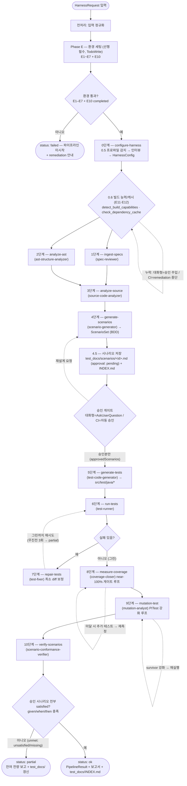
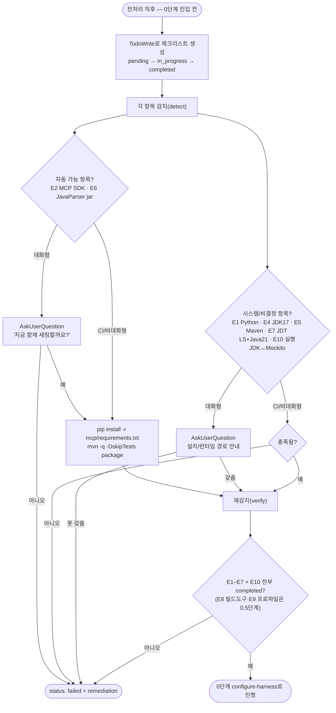
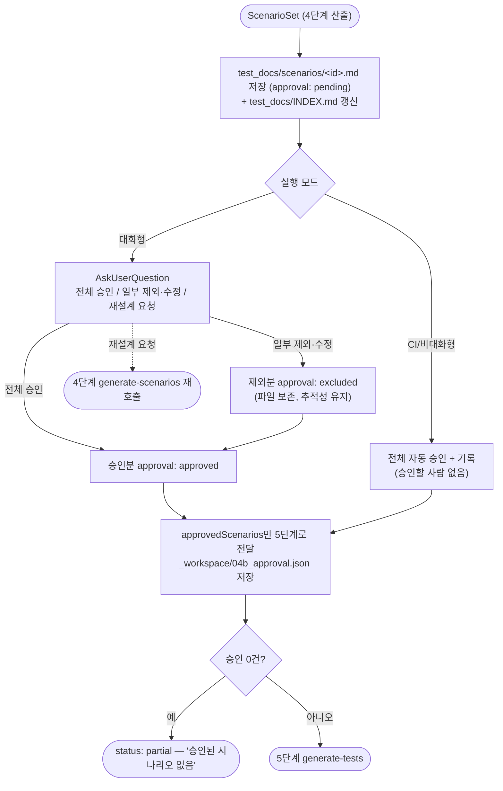
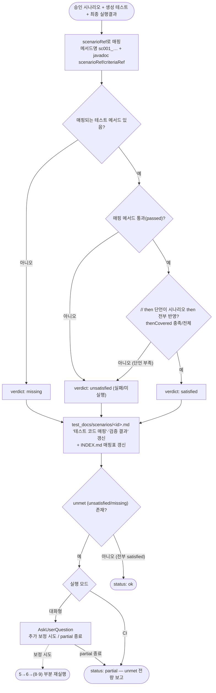
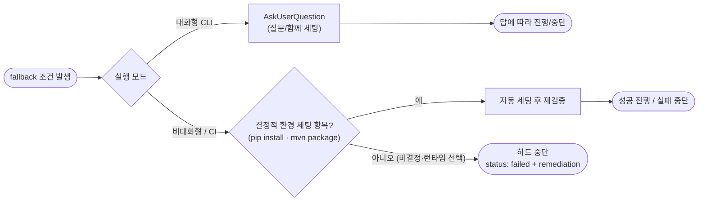
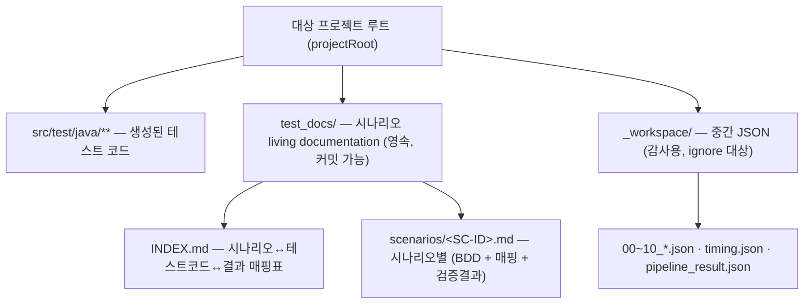

# 파이프라인 흐름도 (Mermaid)

이 문서는 `spring-test-harness` 플러그인이 **어떤 흐름으로 구동되는지**를 Mermaid 다이어그램으로 정리한 것이다.
정본(텍스트): [skills/full-pipeline/SKILL.md](../skills/full-pipeline/SKILL.md) ·
[references/environment-setup.md](../references/environment-setup.md) ·
[references/scenario-docs.md](../references/scenario-docs.md) ·
[references/fallback-policy.md](../references/fallback-policy.md).

> 표기 규칙: 사각형=처리 단계, 마름모=의사결정/게이트, 둥근모서리=시작/종료. 점선 화살표=루프/되돌아감.
> 대화형(사람 있음)은 `AskUserQuestion`, 비대화형·CI(`claude -p`)는 자동 세팅 또는 하드 중단으로 분기한다.

---

## 1. 전체 파이프라인 (end-to-end)

> 1·2단계는 **병렬**(서브에이전트 팬아웃)이라 `E`에서 두 갈래로 갈라져 `G`(3단계)에서 합류한다.
> 7·8·9단계는 **게이트 충족까지 반복**하며, 직전과 동일한 실패/gap/survivor가 3회 연속(무진전)이면 `partial`로 중단한다(fallback-policy.md #12).

---

## 2. Phase E — 환경 세팅 (선(先) 세팅, 후(後) 실행)

근거: [environment-setup.md](../references/environment-setup.md) (E2 `mcp[cli]>=1.2.0`, E6 `astcli-1.0.0-shaded.jar`,
E7 Eclipse JDT LS Java 21+ 런타임, E10 Mockito/ByteBuddy JDK 24/25 호환).

---

## 3. 4.5단계 — 시나리오 승인 게이트 + `test_docs/`

근거: [scenario-docs.md](../references/scenario-docs.md) §3, [fallback-policy.md](../references/fallback-policy.md) #15.

---

## 4. 10단계 — 시나리오 적합성 검증 (마지막)

근거: [scenario-docs.md](../references/scenario-docs.md) §4, [fallback-policy.md](../references/fallback-policy.md) #16.

---

## 5. Fallback 의사결정 공통 패턴 (대화형 vs CI)

모든 fallback 지점은 같은 패턴으로 분기한다(SSOT: [fallback-policy.md](../references/fallback-policy.md)).

> MCP 서버(stdio)는 비대화형이라 직접 질문하지 못한다 — 조건을 신호(`status:failed`/`requiresConfirmation`/`degraded`/error code)로
> **노출만** 하고, 질문/중단은 이를 소비하는 **스킬·에이전트 계층**이 수행한다(공통규칙 3).

---

## 6. 단계 ↔ 스킬 ↔ 에이전트 ↔ MCP 매핑

| 단계 | 스킬 | 에이전트 | 주 MCP | 산출물 |
|---|---|---|---|---|
| Phase E | configure-harness (Preflight) | — | build-test(detect) | (환경 통과) |
| 0 | configure-harness | — | build-test(`detect_spring_profile`) | `HarnessConfig`, `_workspace/00_*.json` |
| 0.6 | configure-harness(빌드 능력·캐시) | — | build-test(`detect_build_capabilities`·`check_dependency_cache`) | `buildChanges[]`, `_workspace/00b_build_provision.json` |
| 1 | ingest-specs | spec-reviewer | spec-doc | `_workspace/01_*.json` |
| 2 | analyze-ast | ast-structure-analyzer | repo-ast | `_workspace/02_*.json` |
| 3 | analyze-source | source-code-analyzer | repo-ast, (lsp) | `_workspace/03_*.json` |
| 4 | generate-scenarios | scenario-generator | spec-doc, repo-ast | `_workspace/04_scenario_set.json` |
| 4.5 | full-pipeline(승인) | — | — | `test_docs/scenarios/*.md`, `INDEX.md`, `04b_approval.json` |
| 5 | generate-tests | test-code-generator | repo-ast, build-test | `src/test/java/*`, `05_*.json` |
| 6 | run-tests | test-runner | build-test | `06_run_result.json` |
| 7 | repair-tests | test-fixer | all | `07_repair_result.json` |
| 8 | measure-coverage | coverage-closer | build-test(JaCoCo) | `08_coverage_result.json` |
| 9 | mutation-test | mutation-analyst | build-test(PITest) | `09_mutation_result.json` |
| 10 | verify-scenarios | scenario-conformance-verifier | repo-ast, build-test | `test_docs/` 갱신, `10_conformance.json` |

---

## 7. 산출물 위치

`test_docs/`는 사람이 읽는 영속 산출물이라 대상 프로젝트에 커밋될 수 있고, `_workspace/`는 운영 중간 산출물이라 ignore 대상이다.

---

## 출처 (사실 확인 2026-06-27)

- Mermaid 공식 flowchart 문법(노드·마름모 의사결정 `{}`·subgraph·방향 `TD/LR`): [Flowcharts Syntax | Mermaid](https://mermaid.ai/open-source/syntax/flowchart.html)
- BDD/Living Documentation 추적성(흐름 설계 근거): [Serenity BDD — Living Documentation](https://serenity-bdd.github.io/docs/reporting/living_documentation), [Cucumber — How does BDD affect traceability](https://cucumber.io/blog/bdd/how-does-bdd-affect-traceability/)
- 단계·정책 정본: 본 저장소 `skills/full-pipeline/SKILL.md`, `references/environment-setup.md`, `references/scenario-docs.md`, `references/fallback-policy.md`
